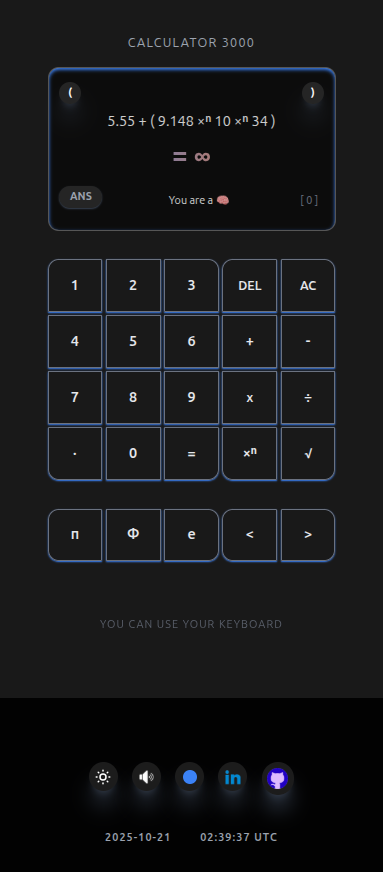

# 🔢 Calculator 3000

<div align="center">


[](https://vuejs.org)
[](https://www.typescriptlang.org)
[](https://tailwindcss.com)
[](https://opensource.org/licenses/MIT)

**A modern, fully-featured calculator built with Vue 3, TypeScript, and TailwindCSS**

<table>
  <tr>
    <td></td>
    <td></td>
    <td></td>
  </tr>
</table>

</div>

---

## 📖 Overview

Calculator 3000 is a powerful web-based calculator application that combines elegant design with advanced mathematical capabilities. Built with modern web technologies, it offers a beautiful user interface with dark mode support, keyboard navigation, and sound effects.

## ✨ Features

- 🎨 **Beautiful UI** - Modern design with dark/light theme support and customizable color themes
- ⌨️ **Keyboard Support** - Full keyboard navigation with visual feedback
- 🔊 **Sound Effects** - Optional audio feedback for button presses
- 🎯 **Advanced Operations** - Support for complex expressions with multiple operands
- 💾 **Memory Functions** - Last result memory and operation history
- 🌈 **Customizable Themes** - Multiple color schemes and theme options
- 📱 **Responsive Design** - Works seamlessly on desktop and mobile devices
- ⚡ **Fast & Lightweight** - Optimized performance with Pinia state management
- 🛡️ **Safe Evaluation** - No eval() usage, secure expression parsing
- 🎭 **Smooth Animations** - Engaging user experience with CSS animations

## 📦 Installation

### Quick Start

```bash
# Clone the repository
git clone https://github.com/alexcolls/calculator3000.git
cd calculator3000/app

# Install dependencies
yarn install
# or
npm install

# Start development server
yarn dev
# or
npm run dev
```

### Prerequisites

- Node.js 16.x or higher
- Yarn or npm package manager

## 🚀 Usage

### Development

```bash
# Start development server with hot-reload
yarn dev

# Access the app at http://localhost:8080
```

### Production Build

```bash
# Build for production
yarn build

# Preview production build
yarn preview
```

### Deployment

```bash
# Deploy to GitHub Pages
yarn deploy

# Or manually with git subtree
git subtree push --prefix app/dist origin gh-pages
```

## 🎮 Keyboard Controls

The calculator supports full keyboard navigation:

- **Numbers**: `0-9` - Enter numbers
- **Operators**: `+`, `-`, `*`, `/` - Mathematical operations
- **Enter/=**: Calculate result
- **Backspace**: Delete last character
- **Escape/C**: Clear display
- **Decimal**: `.` - Add decimal point

## 🔧 Configuration

### Theme Customization

Customize the calculator appearance through the settings panel:

- **Color Theme**: Choose from multiple color schemes (red, blue, green, purple, etc.)
- **Dark/Light Mode**: Toggle between light and dark themes or use system preference
- **Sound Effects**: Enable/disable button click sounds
- **Animations**: Toggle bounce animations

### Advanced Settings

Edit `vue.config.js` or `tailwind.config.js` to customize:

- Color schemes
- Font families
- Button styles
- Animation timings

## 🏗️ Architecture

### Tech Stack

- **Vue 3** - Progressive JavaScript framework with Composition API
- **TypeScript** - Type-safe JavaScript with enhanced IDE support
- **Pinia** - Modern state management for Vue 3
- **TailwindCSS** - Utility-first CSS framework
- **Vite** - Next-generation frontend tooling

### Project Structure

```
app/
├── public/              # Static assets
├── src/
│   ├── assets/          # Images, sounds, and other assets
│   ├── components/      # Vue components
│   │   ├── ConsoleScreen.vue
│   │   ├── KeyboardPanel.vue
│   │   ├── MathButtons.vue
│   │   ├── FooterBar.vue
│   │   └── SettingsButtons.vue
│   ├── services/        # Business logic and state management
│   │   └── store.ts     # Pinia store
│   ├── utils/           # Utility functions
│   ├── App.vue          # Root component
│   ├── main.ts          # Application entry point
│   └── index.css        # Global styles
├── babel.config.js
├── tailwind.config.js
├── tsconfig.json
└── package.json
```

### Key Components

- **ConsoleScreen**: Display area for input and results
- **KeyboardPanel**: Number and basic operation buttons
- **MathButtons**: Advanced mathematical functions
- **FooterBar**: Clock, date, and application info
- **SettingsButtons**: Theme controls and customization options

## 🎯 Roadmap

### Phase 1: Core Improvements
- [ ] Refactor components into smaller, reusable pieces
- [ ] Extract business logic to services layer
- [ ] Add scientific notation support
- [ ] Implement %, sin(), cos(), tan() operators

### Phase 2: Advanced Math
- [ ] Arrays and matrices support
- [ ] Statistical functions (mean, median, mode, variance, stdev)
- [ ] Correlation functions (covariance, pearsonCorr, r2)
- [ ] Equation solver with Greek letters
- [ ] Derivative calculations with differential operator
- [ ] Complex number support

### Phase 3: Enhanced UX
- [ ] LaTeX syntax for operation display
- [ ] Animations for special results (NaN, Infinity, errors)
- [ ] Additional math constants (φ, τ, etc.)
- [ ] Expression history and favorites

### Phase 4: Terminal Mode
- [ ] Letter keyboard for terminal commands
- [ ] OpenAI API integration
- [ ] Web3 wallet adapters for crypto transactions
- [ ] Web scraping commands
- [ ] Multimedia support (images, audio, video)
- [ ] Speech-to-text & text-to-speech

### Phase 5: Backend & Services
- [ ] Node.js/Bun backend server
- [ ] Cloud database integration
- [ ] User authentication
- [ ] Cloud sync for settings and history
- [ ] Multi-device support

## 🤝 Contributing

Contributions are welcome! Feel free to submit a Pull Request.

### How to Contribute

1. **Fork the repository**
2. **Create your feature branch** (`git checkout -b feature/AmazingFeature`)
3. **Commit your changes** (`git commit -m '✨ Add some AmazingFeature'`)
4. **Push to the branch** (`git push origin feature/AmazingFeature`)
5. **Open a Pull Request**

### Development Guidelines

- Follow Vue 3 Composition API best practices
- Use TypeScript for type safety
- Write meaningful commit messages with emojis
- Maintain consistent code style
- Add comments for complex logic
- Test thoroughly before submitting PR

### Code Quality Standards

1. **Modular Code** - Keep components small and focused
2. **Type Safety** - Use TypeScript interfaces and types
3. **No eval()** - Secure expression evaluation
4. **Error Handling** - Proper error reporting and recovery
5. **Performance** - Optimize for speed and efficiency

## 📝 Technical Requirements

### Core Requirements

✅ Perform operations on two or more numbers  
✅ Basic error reporting and handling  
✅ Modular, maintainable code structure  
✅ Secure evaluation (no eval injection vulnerabilities)  

### Advanced Features

✅ Support for complex operations (3+ operands)  
✅ Last result memory functionality  
✅ Pinia state management  
✅ TailwindCSS utility-first styling  
✅ Composition API architecture  
✅ TypeScript type system with interfaces  
✅ SOLID principles and design patterns  

## 📄 License

[MIT License](./LICENSE.md)

Copyright (c) 2025 [Alex Colls](https://github.com/alexcolls)

Permission is hereby granted, free of charge, to any person obtaining a copy
of this software and associated documentation files (the "Software"), to deal
in the Software without restriction, including without limitation the rights
to use, copy, modify, merge, publish, distribute, sublicense, and/or sell
copies of the Software, and to permit persons to whom the Software is
furnished to do so, subject to the following conditions:

The above copyright notice and this permission notice shall be included in all
copies or substantial portions of the Software.

THE SOFTWARE IS PROVIDED "AS IS", WITHOUT WARRANTY OF ANY KIND, EXPRESS OR
IMPLIED, INCLUDING BUT NOT LIMITED TO THE WARRANTIES OF MERCHANTABILITY,
FITNESS FOR A PARTICULAR PURPOSE AND NONINFRINGEMENT. IN NO EVENT SHALL THE
AUTHORS OR COPYRIGHT HOLDERS BE LIABLE FOR ANY CLAIM, DAMAGES OR OTHER
LIABILITY, WHETHER IN AN ACTION OF CONTRACT, TORT OR OTHERWISE, ARISING FROM,
OUT OF OR IN CONNECTION WITH THE SOFTWARE OR THE USE OR OTHER DEALINGS IN THE
SOFTWARE.

## 🙏 Acknowledgments

Built with [Vue 3](https://vuejs.org), [TypeScript](https://www.typescriptlang.org), [TailwindCSS](https://tailwindcss.com), [Pinia](https://pinia.vuejs.org), and [Vite](https://vitejs.dev).

---

## ⭐ Show Your Support

If this project helped you, please consider:

- ⭐ **Starring the repository**
- 🐛 **Reporting bugs**
- 💡 **Suggesting features**
- 🤝 **Contributing code**
- 📢 **Sharing with others**

---

<p align="center">
  <b>Made with ❤️ and Vue 3</b><br>
  <i>Calculate anything, beautifully</i>
</p>

<p align="center">
  <sub>© 2025 Calculator 3000 | MIT License</sub>
</p>
